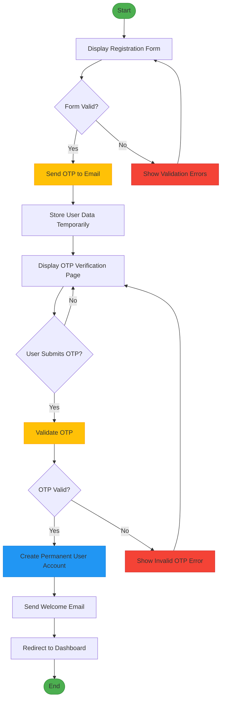

# 🔒 EndSync Authentication System

A secure and seamless authentication solution for modern applications.  
**EndSync** provides robust user registration, OTP verification, login, and logout functionalities with enterprise-grade security.

---

## ✨ Core Features

| Feature                  | Description                                                               |
| ------------------------ | ------------------------------------------------------------------------- |
| 📝 **User Registration** | Secure sign-up with email + password validation (6+ chars, special chars) |
| 🔐 **OTP Verification**  | ⏳ Time-sensitive (5 min), email-based 6-digit One-Time Password          |
| 🔑 **User Login**        | JWT-based authentication with brute-force protection (5-attempt lockout)  |
| 🚪 **User Logout**       | Instant session termination + token revocation                            |
| 🛡️ **Security**          | BCrypt hashing (10 rounds) + HTTPS enforcement + PII protection           |

---

## 🚀 Getting Started

### 1. User Registration

**Step 1:** Navigate to `/register`  
**Step 2:** Complete the registration form:

- Valid email address
- Strong password (min. 6 chars, mixed case, special characters)
- Password confirmation

**Step 3:** Submit → OTP will be sent to your email



---

### 2. OTP Verification

**Step 1:** Locate the 6-digit OTP in your inbox  
**Step 2:** Access `/verify-otp`  
**Step 3:** Enter OTP and verify

> ⏳ OTPs expire in 5 minutes for security Purpose

---

### 3. User Login

```http
POST /login
Content-Type: application/json

{
  "email": "user@example.com",
  "password": "SecurePass123!"
}
```

## 🔐 Security Architecture

- Layer Protection
- Password Storage BCrypt hashing (10 rounds)
- OTP Handling Time-based (TOTP), single-use
- Brute Force 5-attempt lockout (30 min cooldown)
- Session Management JWT with 24h expiration

## 🆘 Support

**For any issues, please contact our security team:**

- 📧 security@endsync.com
- 🔒 PGP Key

---